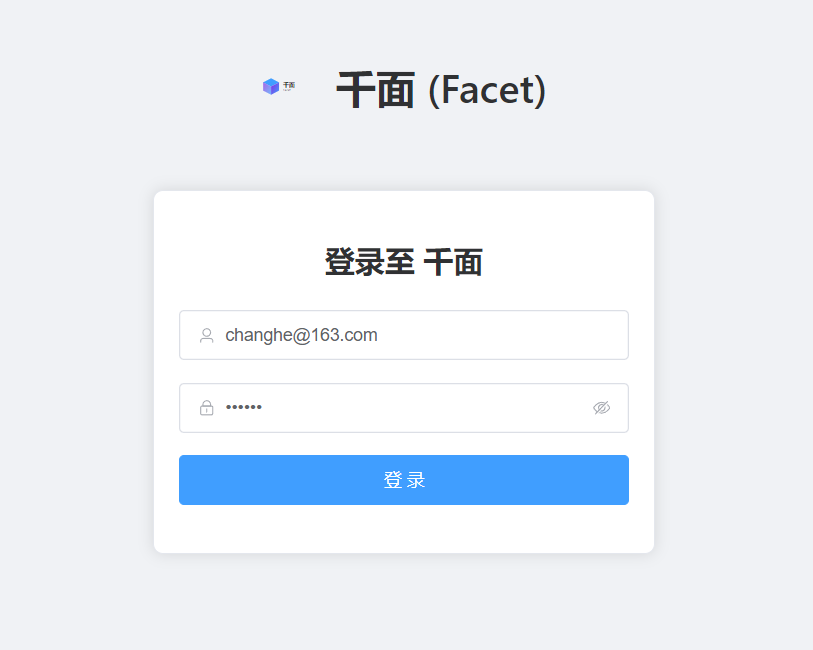
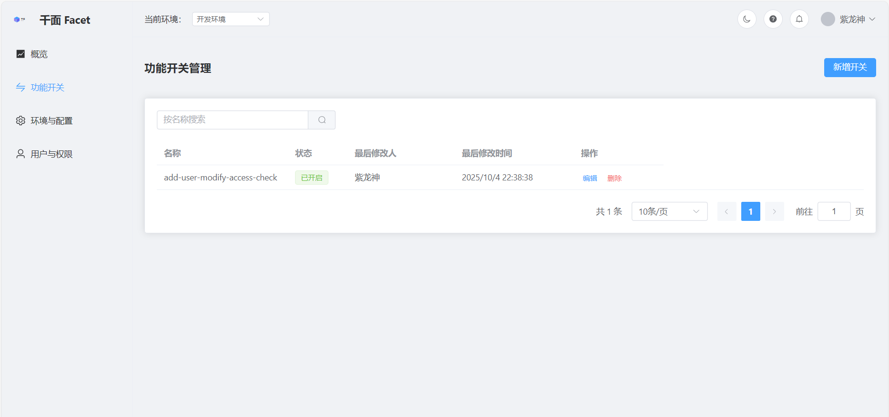
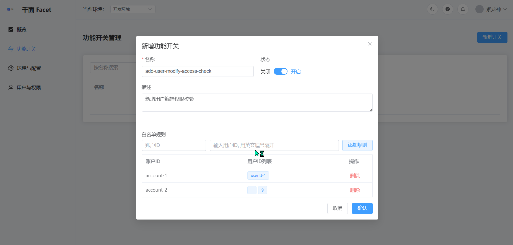
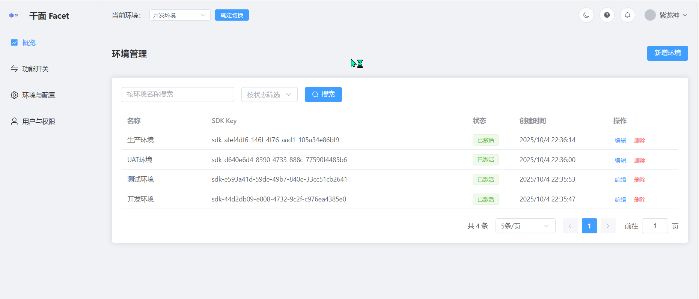
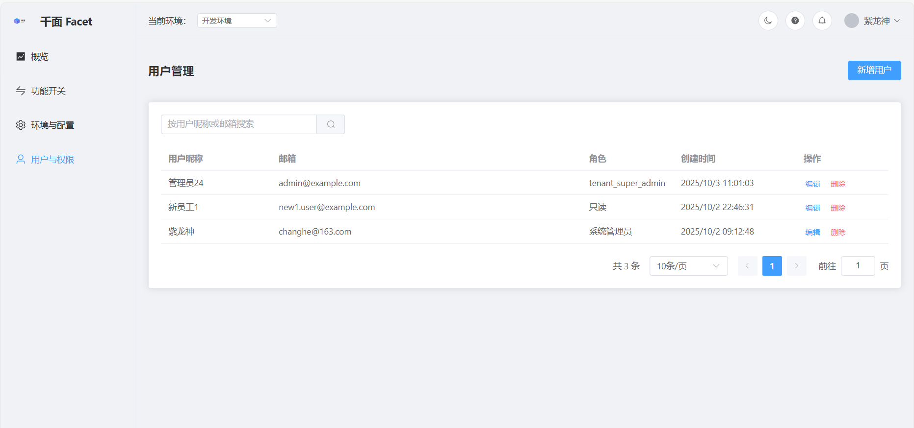
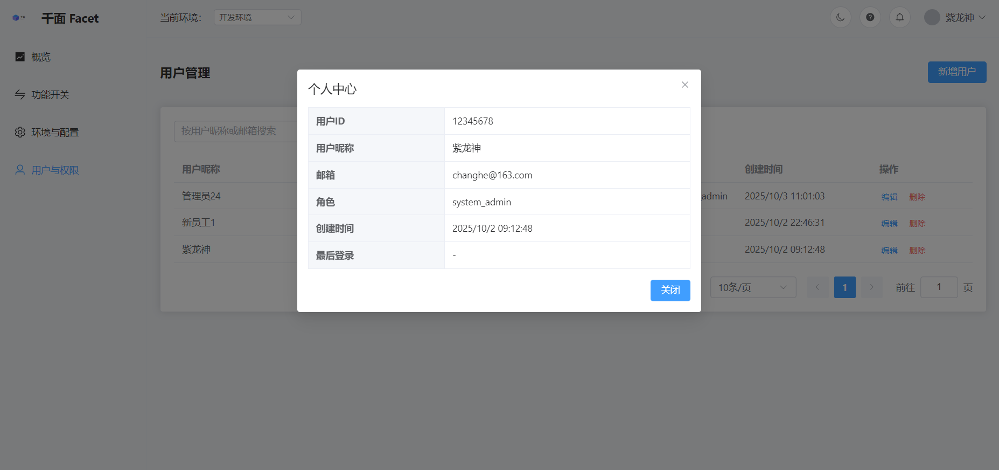
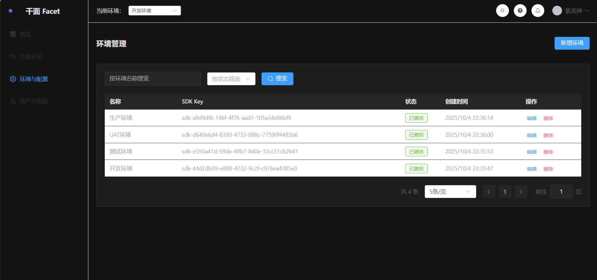

# Facet - 企业级功能开关与 A/B 测试平台

<p align="center">
  
</p>

<p align="center">
  <strong>一个现代化、高性能、功能完备的功能开关 (Feature Flag) 与 A/B 测试解决方案</strong>
</p>

<p align="center">
    <a href="https://github.com/your-repo/facet-front/blob/main/LICENSE">
        
    </a>
    <a href="https://github.com/your-repo/facet-front/stargazers">
        
    </a>
    <a href="https://github.com/your-repo/facet-front/forks">
        
    </a>
</p>

---

`Facet` 是一个为现代软件开发团队量身打造的功能发布与实验平台。无论您是前端开发者、移动端工程师，还是后端架构师，`Facet` 都能为您提供统一、动态、精细化的功能管理能力，让您的团队能够更安全、更快速、更智能地发布产品。

**当前状态**: 🚀 **前端已开源！** 我们非常欢迎社区的贡献和反馈。后端服务目前暂未开源，但我们提供了详尽的架构介绍，以展示其企业级的稳定性和卓越性能。

## 🤔 为什么我需要功能开关？一个真实的例子

让我们通过一个每个开发团队都可能经历的场景，来感受功能开关的真正威力。

**场景**：您的团队即将发布一个重磅新功能——经过全新设计的电商结算页面。

---

#### **传统发布的“惊心动魄”**

1.  **漫长的“发布火车”**：为了这个结算页面，所有相关的新代码（包括其他小功能和 Bug 修复）都被合并到了一个发布分支。大家小心翼翼，生怕引入新问题，导致整个“发布火车”延误。

2.  **紧张的“发布窗口”**：发布日定在周四凌晨2点，这是流量最低的时间。运维、开发、测试的同学组成“护航队”，严阵以待，准备随时处理突发状况。

3.  **深夜的“紧急告警”**：发布成功了。但半小时后，监控系统开始疯狂报警——新结算页的一个隐藏 Bug 导致支付成功率暴跌。用户无法下单，客服电话被打爆，业务正在真金白银地亏损。

4.  **高昂的“回滚代价”**：在巨大压力下，团队决定紧急回滚。但这不仅需要再走一遍完整的部署流程，还将导致**本次发布的所有功能（包括那个无辜的小功能和 Bug 修复）全部被撤销**。第二天，还要组织一场令人疲惫的“故障复盘会”。

这是一种高风险、高压力的工作模式，它消耗着团队的热情，也限制了产品创新的速度。

---

#### **使用 Facet 后的“优雅从容”**

现在，您的新结算页面代码被一个名为 `new-checkout-page` 的功能开关包裹着，这个开关在 Facet 平台中**默认关闭**。

1.  **持续部署，安全上线**：新结算页面的代码一完成测试，就可以**立即部署到生产环境**。因为开关是关闭的，所以它就像“隐身”了一样，对所有用户都不可见。**部署和发布从此彻底分离**，团队再也不用等待“发布窗口”。

2.  **生产验证，心中有底**：在 Facet 平台上，您将这个开关**仅对内部测试账号**开启。团队可以在**真实的生产环境**中，用真实的支付流程和数据来充分验证新功能，这能发现许多在测试环境中无法暴露的问题。

3.  **小步快跑，灰度放量**：验证通过后，您开始灰度发布。首先，向 **1% 的用户**开启开关。您从容地观察着支付成功率、页面性能等核心指标。一切平稳。

4.  **数据驱动，从容推广**：在接下来的几天里，您根据业务数据，通过在 Facet 界面上轻松点击，将开关的开放比例逐步调整到 10%、50%，最终达到 100%。整个过程平滑、可控，产品和运营团队甚至可以主导这个发布过程。

5.  **“一键止损”，风险秒解**：**设想一下**，在灰度到 50% 时，您发现一个仅在特定网络环境下才会出现的 Bug。此时，您要做的不是打电话把工程师从被窝里叫起来，而是**打开 Facet 平台，轻轻一点，将开关关闭**。
    > 有问题的结算页面瞬间对所有用户“消失”，系统恢复如初。整个过程无需部署，无需代码改动，耗时不到 1 秒。团队可以在正常工作时间，从容地修复问题。

通过这个对比，您可以看到，功能开关不仅仅是一个技术工具，它更是一种现代化的发布思想，能极大地**降低发布风险、提升团队幸福感，并赋予业务真正的控制权**。

## ✨ 核心功能

- 🚩 **功能开关 (Feature Flags)**: 在无需重新部署代码的情况下，动态控制功能的开启或关闭。轻松实现功能的“一键上线”与“一键回滚”。
- 🔬 **A/B 测试 (A/B Testing)**: 为不同的用户群体展示不同的产品特性（如 UI 样式、推荐算法、业务流程），通过数据驱动决策，科学地选择最佳方案。
- 🎯 **灰度发布 (Canary Release)**: 将新功能逐步开放给一小部分用户（如内部员工、VIP 用户、特定地区用户），在全量发布前充分验证其稳定性和影响。
- 🏢 **多租户与多环境管理**: 内置企业级的多租户体系，并支持为开发、测试、生产等不同环境配置完全隔离的功能开关策略。
- 🎛️ **强大的规则引擎**: 支持基于用户 ID、IP 地址、用户属性（如 `age > 30`）、设备类型等多种维度的复杂规则，实现高度灵活的定向发布。
- 📊 **（规划中）数据分析与洞察**: 自动收集实验数据，提供直观的报表，帮助您分析实验结果，做出明智的产品决策。

## 🚀 为什么选择 Facet?

相比于其他解决方案或手动管理，`Facet` 提供了无与伦比的优势：

- **技术先进，性能卓越**: 后端采用 Go (Gin + Redis + pgx) 构建，具备高并发、低延迟的特性，能够轻松应对大规模的评估请求。前端采用 Vue 3 + Vite，提供了极致的开发体验和流畅的用户交互。
- **架构健壮，为生产而生**: 后端设计遵循了严格的分层架构和领域驱动设计（DDD）思想，并内置了如优雅停机、结构化日志、事务管理等生产级的最佳实践，确保了系统的稳定性和可维护性。
- **功能完备，开箱即用**: 提供了从功能创建、规则配置到环境管理的全套可视化操作界面，让非技术人员（如产品经理、运营）也能轻松参与到功能发布流程中。
- **易于集成**: 无论是前端应用、移动 App 还是后端微服务，都可以通过轻量级的 SDK 或简单的 HTTP API 调用，快速接入 `Facet` 的功能评估服务。

## 🚀 产品概览

通过以下截图，您可以快速了解 Facet 的核心功能和现代化界面。

| 功能点 | 简要说明 | 预览图 |
| :--- | :--- | :--- |
| **登录界面** | 简洁明了的登录入口，支持记住密码。 |  |
| **功能开关列表** | 集中管理所有功能开关，状态、环境、更新时间一目了然。 |  |
| **新增与编辑** | 提供直观的表单，轻松创建或修改功能开关的规则。 |  |
| **环境管理** | 管理开发、测试、生产等多个环境，并为每个环境生成独立的 SDK Key。 |  |
| **用户管理** | 精细化的用户权限控制，支持“读写”和“只读”两种角色。 |  |
| **个人中心** | 查看个人信息，管理账户设置。 |  |
| **暗黑主题** | 内置优雅的暗黑模式，提供舒适的夜间使用体验。 |  |

## 🛠️ 技术栈

`Facet` 采用了业界领先的、经过生产环境检验的技术栈，以确保其高性能、高可靠性和高可维护性。

| 模块 | 技术 | 亮点 |
| :--- | :--- | :--- |
| **前端 (Frontend)** | `Vue 3`, `Vite`, `Element Plus`, `TypeScript` | 现代化的前端框架，提供极致的开发体验和响应迅速的 UI。 |
| **后端 (Backend)** | `Go`, `Gin`, `PostgreSQL (pgx)`, `JWT` | 高性能语言与框架，纯粹的 `pgx` 驱动带来极致的数据库性能。 |
| **架构思想** | 分层架构, DDD, 缓存优先, 事务管理 | 清晰的架构设计，确保了代码的高内聚、低耦合和长期可维护性。 |
| **部署** | `Docker`, 多阶段构建 | 提供优化的 `Dockerfile`，实现快速、轻量级的容器化部署。 |

## 💻 各语言 SDK & 使用示例

我们为不同语言和环境提供了相应的 SDK，方便您在自己的应用中快速集成 Facet 的功能。

请点击以下链接，查看对应语言的详细接入指南和代码示例：

### ☕️ Java

-   [Java 17+](docs/java17.md)
-   [Java 11](docs/java11.md)
-   [Java 8](docs/java8.md)

### 🐹 Go

-   [Go (版本 >= 1.18)](docs/go_after_1_18.md)
-   [Go (版本 < 1.18)](docs/go_before_1_18.md)

### 📜 JavaScript

-   [Web / 浏览器环境](docs/javascript_web.md)
-   [Node.js (版本 >= 18)](docs/javascript_after_node_18.md)
-   [Node.js (版本 < 18)](docs/javascript_before_node_18.md)

我们正在积极开发更多语言的 SDK，敬请期待！

## 💬 联系我们 & 立即体验

我们搭建了一个公开的演示环境，让您可以立即上手体验 Facet 的全部功能！

由于平台需要账户权限管理，请通过以下任一方式联系我们，我们将非常乐意为您开通测试账户：

-   **邮箱**: `changhe626@163.com`
-   **微信**: 添加时请备注 "Facet"


我们非常期待您的试用反馈，您的任何建议都将帮助 Facet 变得更好！


## 🚀 快速开始 (前端)

想立即体验 `Facet` 吗？您可以轻松地在本地运行前端项目。

本项目采用当前主流的 Vue 3 生态系统进行构建，技术选型如下：

*   **前端框架**: Vue 3 (使用 `<script setup>` 的组合式 API)
*   **构建工具**: Vite
*   **UI 组件库**: Element Plus
*   **路由管理**: Vue Router
*   **HTTP 请求**: Axios
*   **部署方案**: Docker + Nginx

###  项目结构

清晰的目录结构是快速上手项目的关键。本项目的核心文件结构如下：

```
facet-front/
├── public/                # 静态资源目录 (此目录下的文件会被直接复制到网站根目录)
│   └── logo.svg
├── src/                   # 核心源码目录
│   ├── api/               # 存放所有后端 API 请求函数
│   │   ├── environment.js
│   │   ├── featureFlags.js
│   │   └── user.js
│   ├── assets/            # 存放需要被 Vite 处理的静态资源 (如图片、全局CSS)
│   │   └── logo.svg
│   ├── layouts/           # 存放主布局组件
│   │   └── MainLayout.vue
│   ├── router/            # 存放路由配置
│   │   └── index.js
│   ├── utils/             # 存放工具函数
│   │   └── request.js     # 封装的 Axios 实例，包含请求/响应拦截器
│   ├── views/             # 存放页面级组件
│   │   ├── Environments.vue
│   │   ├── FeatureFlags.vue
│   │   ├── Login.vue
│   │   ├── Overview.vue
│   │   └── Users.vue
│   ├── App.vue            # Vue 应用的根组件，用于挂载路由和全局配置
│   └── main.js            # 应用的入口文件
├── .dockerignore          # 配置 Docker 构建时忽略的文件
├── .gitignore             # 配置 Git 忽略的文件
├── Dockerfile             # 用于构建生产环境 Docker 镜像
├── index.html             # 应用的 HTML 入口
├── nginx.conf             # Nginx 生产环境配置文件
├── package.json           # 项目依赖与脚本配置
└── vite.config.js         # Vite 配置文件 (包含开发时的 API 代理)
```

1.  **克隆仓库**:
    ```sh
    git clone https://github.com/your-repo/facet-front.git
    cd facet-front
    ```

2.  **安装依赖 (需要 Node.js >= 20)**:
    ```sh
    npm install
    ```

3.  **启动开发服务器**:
    ```sh
    npm run dev
    ```

4.  **访问**: 打开浏览器，访问 `http://localhost:5173`。

> **注意**: 由于后端未开源，您在本地运行前端时，API 请求会失败。我们建议您通过 Mock 工具（如 Apifox, Postman）来模拟后端 API，以便进行前端功能的开发和调试。

## 🗺️ 路线图 (Roadmap)

我们对 `Facet` 的未来充满期待，并规划了许多激动人心的功能和优化。以下是我们近期的重点方向：

-   ✅ **(已完成)** 数据库驱动升级与 N+1 问题解决
-   ✅ **(已完成)** 生产级的日志系统升级
-   ✅ **(已完成)** 数据库 Schema 驱动的领域模型重构
-   ▶️ **(最高优先级)** 引入 Redis 作为统一缓存层以优化性能
-   ▶️ 实现服务器的优雅停机 (Graceful Shutdown)
-   ▶️ 通过环境变量管理敏感配置

我们欢迎社区开发者参与贡献，共同塑造 `Facet` 的未来！

## ❤️ 贡献

我们热烈欢迎任何形式的贡献！无论是提交 Issue、发起 Pull Request，还是改进文档，都是对社区的巨大帮助。

请在贡献前阅读我们的 [贡献指南](CONTRIBUTING.md)。

## 📄 许可证

`Facet` 前端项目采用 [MIT License](LICENSE) 开源。
